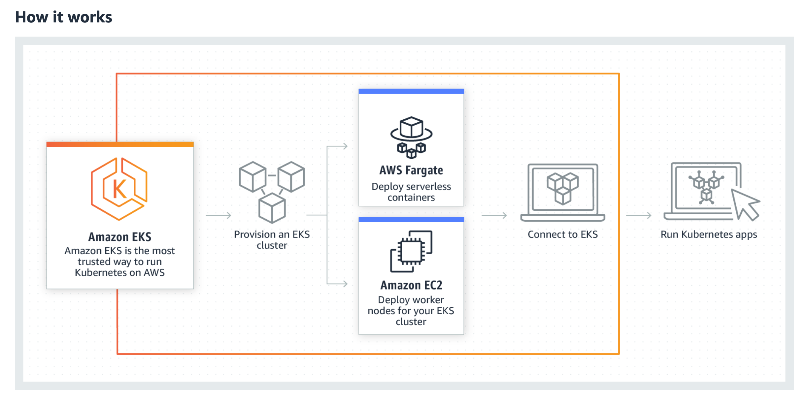
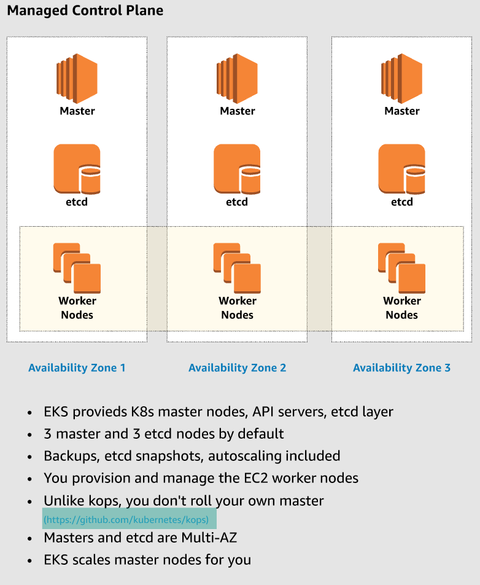
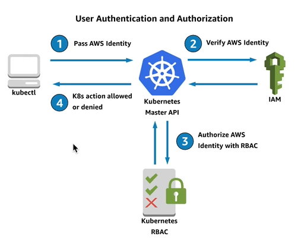
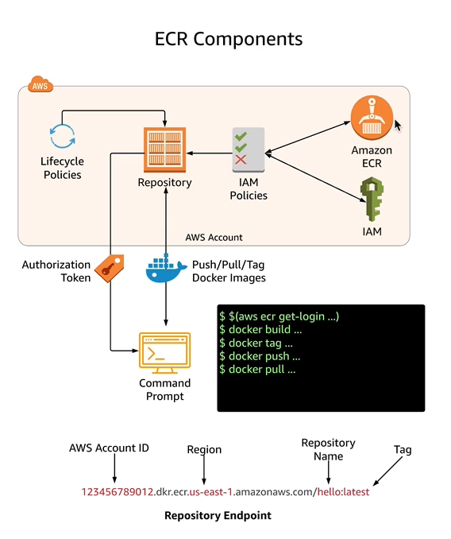
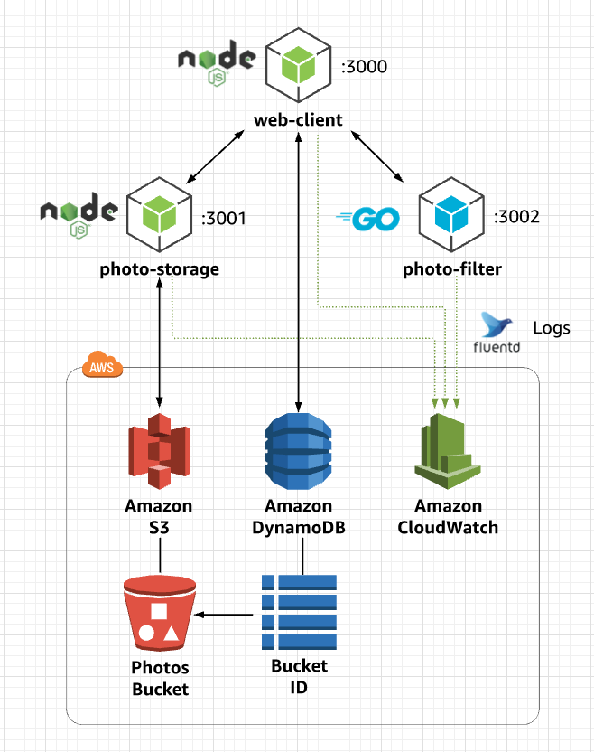
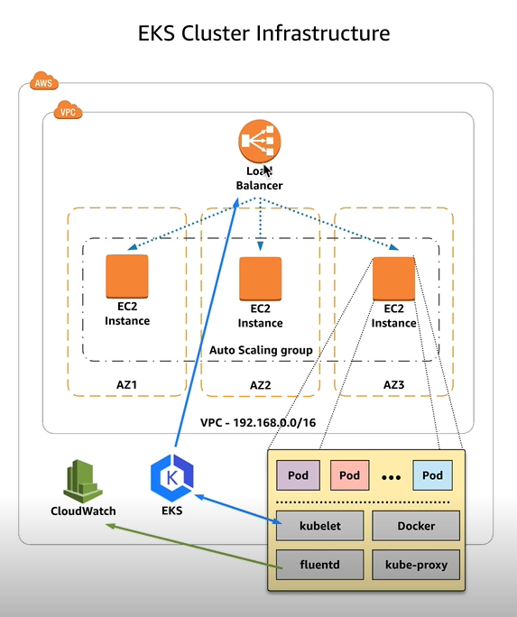

# EKS Notes

EKS is a fully managed Kubernetes over the AWS cloud.



It provides full managed Master Nodes and etcd over 3 different AZs:



The CNI pluggin manages the association of pods/instances/ip addresses. The instance's ENI get secondary IP addresses and they get associated with pods via the CNI pluggin.


VPC example template for EKS

https://amazon-eks.s3-us-west-2.amazonaws.com/cloudformation/2018-11-07/amazon-eks-vpc-sample.yaml

Kubectl

https://kubernetes.io/es/docs/tasks/tools/install-kubectl/

Amazon EKS uses IAM to provide authentication to your Kubernetes cluster through the AWS IAM Authenticator for Kubernetes. You can configure the stock kubectl client to work with Amazon EKS by installing the AWS IAM Authenticator for Kubernetes and modifying your kubectl configuration file to use it for authentication.

https://docs.aws.amazon.com/eks/latest/userguide/install-aws-iam-authenticator.html

Launch worker nodes:

https://amazon-eks.s3-us-west-2.amazonaws.com/cloudformation/2018-11-07/amazon-eks-nodegroup.yaml

### EKS Optimized AMI

The Amazon EKS-optimized Linux AMI is built on top of Amazon Linux 2, and is configured to serve as the base image for Amazon EKS worker nodes. The AMI is configured to work with Amazon EKS out of the box, and it includes Docker, kubelet, and the AWS IAM Authenticator. 

AMI ID for us-east-2: ami-053250833d1030033

https://docs.aws.amazon.com/eks/latest/userguide/eks-optimized-ami.html

In order to the worker nodes to join the cluster, we'll need a configuration map:

```
curl -O https://amazon-eks.s3-us-west-2.amazonaws.com/cloudformation/2018-11-07/aws-auth-cm.yaml
kubectl apply -f aws-auth-cm.yaml
kubectl get nodes --watch
```

Deploy the Kubernetes dashboard:

```
kubectl apply -f https://raw.githubusercontent.com/kubernetes/dashboard/v1.10.1/src/deploy/recommended/kubernetes-dashboard.yaml
```

https://github.com/kubernetes/dashboard

Deploy Heapster and InfluxDB:

```
kubectl apply -f https://raw.githubusercontent.com/kubernetes/heapster/master/deploy/kube-config/influxdb/heapster.yaml
kubectl apply -f https://raw.githubusercontent.com/kubernetes/heapster/master/deploy/kube-config/influxdb/influxdb.yaml
kubectl apply -f https://raw.githubusercontent.com/kubernetes/heapster/master/deploy/kube-config/rbac/heapster-rbac.yaml
```

Create an administrative account and cluster role binding

```
kubectl apply -f eks-admin-service-account.yaml
kubectl apply -f eks-admin-cluster-role-binding.yaml
```

Authenticate and get token:

```
aws-iam-authenticator -i EKSDeepDive token
aws-iam-authenticator -i EKSDeepDive token | jq -r .status.token
```

Start proxy

```
kubectl proxy --address 0.0.0.0 --accept-hosts '.*' &
aws-iam-authenticator -i <cluster_name> token
```

IAM Authentication on EKS



Edit AWS Auth Config Map:

```
kubectl edit -n kube-system configmap/aws-auth
```

Example of my current config:

```
# Please edit the object below. Lines beginning with a '#' will be ignored,
# and an empty file will abort the edit. If an error occurs while saving this file will be
# reopened with the relevant failures.
#
apiVersion: v1
data:
  mapRoles: |
    - rolearn: arn:aws:iam::057866020917:role/EKS-WorkerNodes-NodeInstanceRole-WEMPFIKBED76
      username: system:node:{{EC2PrivateDNSName}}
      groups:
        - system:bootstrappers
        - system:nodes
  mapUsers: |
    - userarn: arn:aws:iam::057866020917:user/jeef
      username: jeff
      groups:
        - system:masters
kind: ConfigMap
metadata:
  annotations:
    kubectl.kubernetes.io/last-applied-configuration: |
      {"apiVersion":"v1","data":{"mapRoles":"- rolearn: arn:aws:iam::057866020917:role/EKS-WorkerNodes-NodeInstanceRole-WEMPFIKBED76\n  username: system:node:{{EC2PrivateDNSName}}\n  groups:\n    - system:bootstrappers\n    - system:nodes\n"},"kind":"ConfigMap","metadata":{"annotations":{},"name":"aws-auth","namespace":"kube-system"}}
  creationTimestamp: "2019-12-10T18:19:06Z"
  name: aws-auth
  namespace: kube-system
  resourceVersion: "3640"
  selfLink: /api/v1/namespaces/kube-system/configmaps/aws-auth
  uid: 8d66ee25-1b79-11ea-a51c-0293cedc7baa
```

The added part is mapUsers, now Alice should have permissions for master.

### ECR



Repo for the sample app:

https://github.com/linuxacademy/eks-deep-dive-2019



Is a managed Docker registry service similar to Docker hub.

```
aws ecr get-login --no-include-email --region us-east-1
$(aws ecr get-login --no-include-email --region us-east-1)
```

This is a replacement for the Docker login command ^

Build the images:

```
docker build --rm -t photo-filter .
docker-compose build # for building all the containers with one command
# then tagging is needed before pushing
docker tag photo-filter <ECR repo URL>
docker tag web-client <ECR repo URL>
docker tag photo-storage <ECR repo URL>
docker push photo-filter <ECR repo URL>
docker push web-client <ECR repo URL>
docker push photo-storage <ECR repo URL>
```

Note: each container has its own repo


Deploy the application:

```
kubectl apply -f ./apps/photo-filter/k8s/deployment.yaml
kubectl apply -f ./apps/photo-filter/k8s/service.yaml
kubectl apply -f ./apps/photo-storage/k8s/deployment.yaml
kubectl apply -f ./apps/photo-storage/k8s/service.yaml
kubectl apply -f ./apps/web-client/k8s/deployment.yaml
kubectl apply -f ./apps/web-client/k8s/service.yaml
```

Verify deployments:

```
kubectl get deployments
kubectl get svc
```

Scaling up backend:

```
kubectl get deployments
kubectl scale deployment photo-filter-deployment --replicas=3
kubectl scale deployment photo-storage-deployment --replicas=3
```

Deleting the application:

```
kubectl delete -f ./apps/photo-filter/k8s/deployment.yaml
kubectl delete -f ./apps/photo-filter/k8s/service.yaml
kubectl delete -f ./apps/photo-storage/k8s/deployment.yaml
kubectl delete -f ./apps/photo-storage/k8s/service.yaml
kubectl delete -f ./apps/web-client/k8s/deployment.yaml
kubectl delete -f ./apps/web-client/k8s/service.yaml
```

Autoscaling an EKS cluster



Horizontal Pod Scaler

Cluster Autoscaler

Helm for managing Kubernetes applications:

```
curl https://raw.githubusercontent.com/kubernetes/helm/master/scripts/get > get_helm.sh
chmod +x get_helm.sh
./get_helm.sh
```

Tiller to manage the cluster:

```
---
apiVersion: v1
kind: ServiceAccount
metadata:
  name: tiller
  namespace: kube-system
---
apiVersion: rbac.authorization.k8s.io/v1beta1
kind: ClusterRoleBinding
metadata:
  name: tiller
roleRef:
  apiGroup: rbac.authorization.k8s.io
  kind: ClusterRole
  name: cluster-admin
subjects:
  - kind: ServiceAccount
    name: tiller
    namespace: kube-system
```

```
kubectl apply -f 3-1-Autoscaling/tiller-rbac.yaml
helm init --service-account tiller
helm install stable/metrics-server --name metrics-server ..version 2.0.4 --namespace metrics
# verify that it worked
kubectl get apiservice v1beta1.metrics.k8s.io -o yaml
```

Let's try with an example application:

```
kubectl run php-apache --image=k8s.gcr.io/hpa-example --request=cpu=200m --expose --port=80
kubectl autoscale deployment php-apache --cpu-percent=50 --min=1 --max=10
kubectl get hpa
kubectl get hpa -w
```

ClusterAutoScaler

Edit the file `/eks-deep-dive-2019/3-1-Autoscaling/cluster_autoscaler.yaml` with the AutoScalingGroup you've created fr your cluster. Change the minimum and maximum also over the AutoScalingGroup.

Also needs a policy to the instance's role:

```
{
    "Version": "2012-10-17",
    "Statement": [
      {
        "Effect": "Allow",
        "Action": [
          "autoscaling:DescribeAutoScalingGroups",
          "autoscaling:DescribeAutoScalingInstances",
          "autoscaling:DescribeTags",
          "autoscaling:SetDesiredCapacity",
          "autoscaling:TerminateInstanceInAutoScalingGroup"
        ],
        "Resource": "*"
      }
    ]
  }
```

```
kubectl apply -f cluster_autoscaler.yaml
kubectl logs -f deployment/cluster-autoscaler -n kube-system
kubectl apply -f nginx.yaml
kubectl get deployment/nginx-scaleout
```


